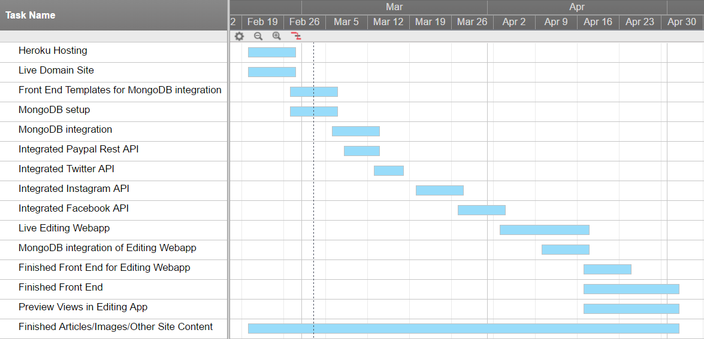

##4.0	Software Development Plan

###4.1	Plan Introduction

This Software Development Plan provides the details of the planned development for the domain site lmuadg.com, the domain site for Alpha Delta Gamma Lambda Chapter at Loyola Marymount University, as well as the accompanying webapp responsible for the maintenance of the site.

On the site users will be able to learn about the chapter and a bit about its history, view a current chapter newsletter detailing current chapter operations, meet the current executive board of the chapter, view a live feed of our social media accounts, including Instagram, Facebook, and Twitter, and send a donation to the chapter via PayPal.  All text and images on the site will be loaded through MongoDB for the purposes of maintenance.  The accompanying webapp, which will be accessible only to myself and select representatives from the chapter, will be responsible for editing the documents in MongoDB in order to keep information on the site correct and up-to-date.

* Heroku Hosting (2/27)
* Live Domain Site (2/27)
* Front End Templates for MongoDB integration (3/6)
* MongoDB setup (3/6)
* MongoDB integration (3/13)
* Integrated Paypal Rest API (3/13)
* Integrated Twitter API (3/20)
* Integrated Instagram API (3/27)
* Integrated Facebook API (4/3)
* Live Editing Webapp (4/10)
* MongoDB integration of Editing Webapp (4/17)
* Finished Front End for Editing Webapp (4/24)
* Finished Front End (5/2)
* Preview Views in Editing App (5/2)
* Finished Articles/Images/Other Site Content (5/2) (Ongoing)

####4.1.1	Project Deliverables

* Software Development Plan or Software Design Description (Re-submit) (3/20)
* Written Status Reports in SDF (3/20)
* Requirments Document (Re-submit) (4/3)
* Written Status Reports in SDF (4/3)
* Written Status Reports in SDF (4/17)
* Final Presentations / Demonstrations (5/4)

##4.2	Project Resources

###4.2.1	Hardware Resources

| Operating System | CPU Name      | CPU speed | # of CPU Cores | Amount of Ram | Name of GPU             | Amount of VRAM | Purpose     |
|:----------------:|---------------|-----------|----------------|---------------|-------------------------|----------------|-------------|
| Windows          | Intel Core i7 | 2.6 GHz   | 4 Cores        | 16 GB         | NVIDIA GeForce GTX 960  | 2 GB           | Development |

###4.2.2	Software Resources

* jQuery
* Materialize
* Node
* Python
* Sublime Text Editor
* Webpack
* MongoDB
* Heroku
* Express

##4.3	Project Organization

The website and accompanying webapp shall be completed in the following sequence.  First, a general front end layout will be created in order to show the customer and to start receiving page content.  Then the backend will be completed so that the app runs via express, hosted on Heroku, and accessible from the purchased domain name.  The MongoDB database will then be set up to store both text and images containing site content.  All social media and Paypal plugins will then be implemented on the live site.  Next, the front end will be linked with the Mongo database, with real populated data.  Next, the editing app will be created to modify the Mongo database.  Finally, the front ends of both the website and webapp will be edited to the specifications of the customer and fine-tuned to be more accessible.

##4.4	Project Schedule

The project schedule for this project is further specified in section 4.4.1.

###4.4.1	GANTT Chart

###4.4.2	Task / Resource Table

| Task    										| Software Used                                                                 | 
|-----------------------------------------------|-------------------------------------------------------------------------------|
| Heroku Hosting 								| Express, Heroku, Sublime Text Editor                                        	|   
| Live Domain Site    							| Express, Heroku, Sublime Text Editor, Google Domains Site                     |   
| Front End Templates for MongoDB integration 	| jQuery, Materialize, Node, Sublime Text Editor, Webpack, Express 				|   
| MongoDB setup 								| Node, Sublime Text Editor, Webpack, MongoDB 									|
| MongoDB integration 							| jQuery, Materialize, Node, Sublime Text Editor, Webpack, Express, MongoDB 	|
| Integrated Paypal Rest API 					| jQuery, Materialize, Node, Sublime Text Editor, Webpack, Express 				|
| Integrated Twitter API 						| jQuery, Materialize, Node, Sublime Text Editor, Webpack, Express 				|
| Integrated Instagram API 						| jQuery, Materialize, Node, Sublime Text Editor, Webpack, Express 				|
| Integrated Facebook API 						| jQuery, Materialize, Node, Sublime Text Editor, Webpack, Express 				|
| Live Editing Webapp 							| jQuery, Materialize, Node, Sublime Text Editor, Webpack, Express, Heroku		|
| MongoDB integration of Editing Webapp 		| jQuery, Materialize, Node, Sublime Text Editor, Webpack, Express, Heroku		|
| Finished Front End for Editing Webapp 		| jQuery, Materialize, Node, Sublime Text Editor, Webpack, Express 				|
| Finished Front End 							| jQuery, Materialize, Node, Sublime Text Editor, Webpack, Express 				|
| Preview Views in Editing App 					| jQuery, Materialize, Node, Sublime Text Editor, Webpack, Express 				| 
| Finished Articles/Images/Other Site Content 	| Microsoft Word, Abobe Illustrator, Photoshop 									|
